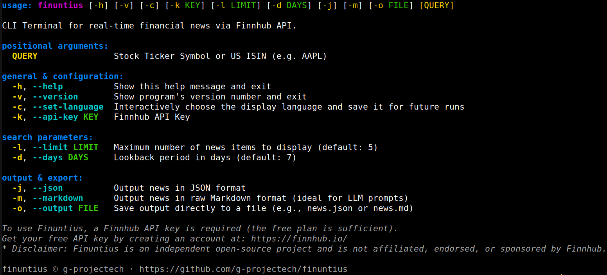
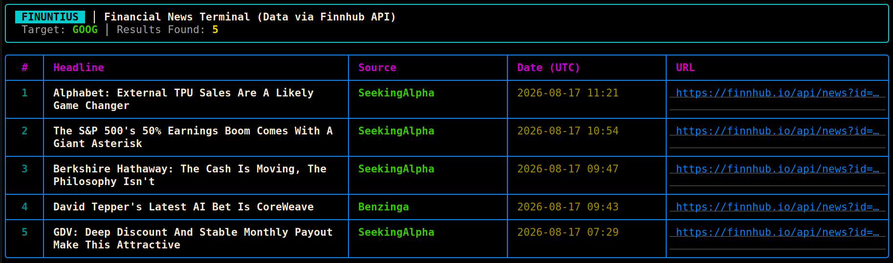

<div align="center">

# 📈 Finuntius

**CLI Terminal for real-time financial news via [Finnhub](https://finnhub.io/) API.**

[](https://pypi.org/project/finuntius/)
[](https://pypi.org/project/finuntius/)
[](https://github.com/g-projectech/finuntius)

</div>



---

## Index

- [What's Finuntius?](#whats-finuntius)
- [Features](#features)
- [Installation](#installation)
  - [From PyPI](#from-pypi)
  - [From GitHub](#from-github)
  - [With Docker](#with-docker)
- [API Key Configuration](#api-key-configuration)
- [Examples of Use](#examples-of-use)
- [Project Structure](#project-structure)
- [Disclaimer](#disclaimer)
- [License](#license)

---

## What's Finuntius?

`Finuntius` is a CLI program available in English (default) or Italian that retrieves the latest financial news about a stock using the [Finnhub API](https://finnhub.io/) and displays it in a formatted table directly in the terminal.

Finuntius is privacy-first. It adopts the BYOK (Bring Your Own Key) approach so that the Finnhub key remains exclusively on your local machine.

You can also export the results in **JSON** or **Markdown**, which is useful for including them, for example, in reports, analysis scripts, or prompts for LLMs.

## Features

- Search for financial news by ticker or U.S. ISIN (`GOOG`, `AAPL`, ...)
- Color-coded table output in the terminal, via [Rich](https://github.com/Textualize/rich)
- Export to **JSON** or **Markdown**, to the screen or to a file (`-o`)
- Cascading API key management: CLI flag `-k`, environment variables, global config, or interactive prompt on first launch
- Bilingual interface: **English** / **Italian**, selectable and persistent
- Filters by number of results (`-l`) and history from previous days (`-d`)
- Docker image available

## Installation

### From PyPI

The modern and recommended way to install CLI applications in Python is using [`pipx`](https://pipx.pypa.io/), which automatically creates an isolated virtual environment:

```bash
pipx install finuntius
finuntius --help
```

Alternatively, you can use the standard pip (it is recommended that you do this inside a virtual environment to avoid conflicts):

```bash
pip install finuntius
finuntius --help
```

### From GitHub

Useful if you want to modify the code or contribute to the project:

```bash
git clone https://github.com/g-projectech/finuntius.git
cd finuntius
```
On Linux / MacOS
```bash
python3 -m venv venv
source venv/bin/activate
```
On Windows:
```powershell
python -m venv venv
venv\Scripts\activate
```

```bash
pip install -e .
```

Installing in “editable” mode (`-e`) also creates the `finuntius.egg-info/` folder (which is automatically generated by `pip`/`setuptools` and is already excluded in the project's `.gitignore` file).

### With Docker

If you'd rather not install anything locally, the repository includes a ready-to-use `Dockerfile`:

```bash
git clone https://github.com/g-projectech/finuntius.git
cd finuntius

docker build -t finuntius .
```

Basic usage (the image passes the arguments to `finuntius`):

```bash
docker run --rm -it -e FINNHUB_API_KEY=your_api_key finuntius GOOG
```

To ensure that the API key and the selected language **persist** between runs, mount a volume on the configuration folder:

```bash
docker run --rm -it \
  -v finuntius_config:/home/finuntius/.config/finuntius \
  finuntius -c  # choose language

docker run --rm -it \
  -v finuntius_config:/home/finuntius/.config/finuntius \
  finuntius GOOG #if the key isn't in the volume, asks and saves it
```

To save an export file (`-o`) to a local folder, mount that folder as well:

```bash
docker run --rm -it \
  -v finuntius_config:/home/finuntius/.config/finuntius \
  -v "$(pwd)/output:/home/finuntius/output" \
  finuntius GOOG -m -o output/newsGOOG.md
```

## API Key Configuration

`finuntius` requires a Finnhub API key; the free plan is sufficient. You can create one on [Finnhub.io](https://finnhub.io/).

The key is searched for, in order of priority:

1. CLI flag: `-k` / `--api-key`
2. Environment variable `FINNHUB_API_KEY` (including from a `.env` file in the current directory)
3. Global configuration file (`~/.config/finuntius/.env`, or `$XDG_CONFIG_HOME/finuntius/.env` if set)
4. Interactive prompt: if not found in the previous locations, `finuntius` will prompt you for it and automatically save it to the global configuration file with `chmod 600` permissions

## Examples of Use

Run the commands to print the news on screen. Use the `-j` (JSON) or `-m` (Markdown) flags in combination with `-o` to export the data—ideal for providing up-to-date context to analysis scripts or LLM prompts.

```bash
# default table (without -j or -m)
finuntius GOOG
```



> Command output.

## Project Structure

```
finuntius/
├── assets/                     # screenshot
├── src/
│   └── finuntius/              # source code
│       ├── __init__.py
│       ├── config.py           # API key, language, configuration
│       ├── exporter.py         # export in JSON; Markdown
│       ├── finnhub_fetcher.py  # calls to the Finnhub API
│       ├── formatter.py        # table rendering with Rich
│       ├── main.py             # entry point
│       └── translations.py     # str en/it
├── Dockerfile
├── pyproject.toml
└── LICENSE
```

## Disclaimer

Finuntius is optimized to work with API keys from Finnhub’s free plan. Future versions may use data available through paid API keys.

⚠️ Finuntius is an independent, open-source project and **is in no way affiliated with, sponsored by, or endorsed by Finnhub**.

## License

This project is released under the [GNU AGPLv3](LICENSE).

---